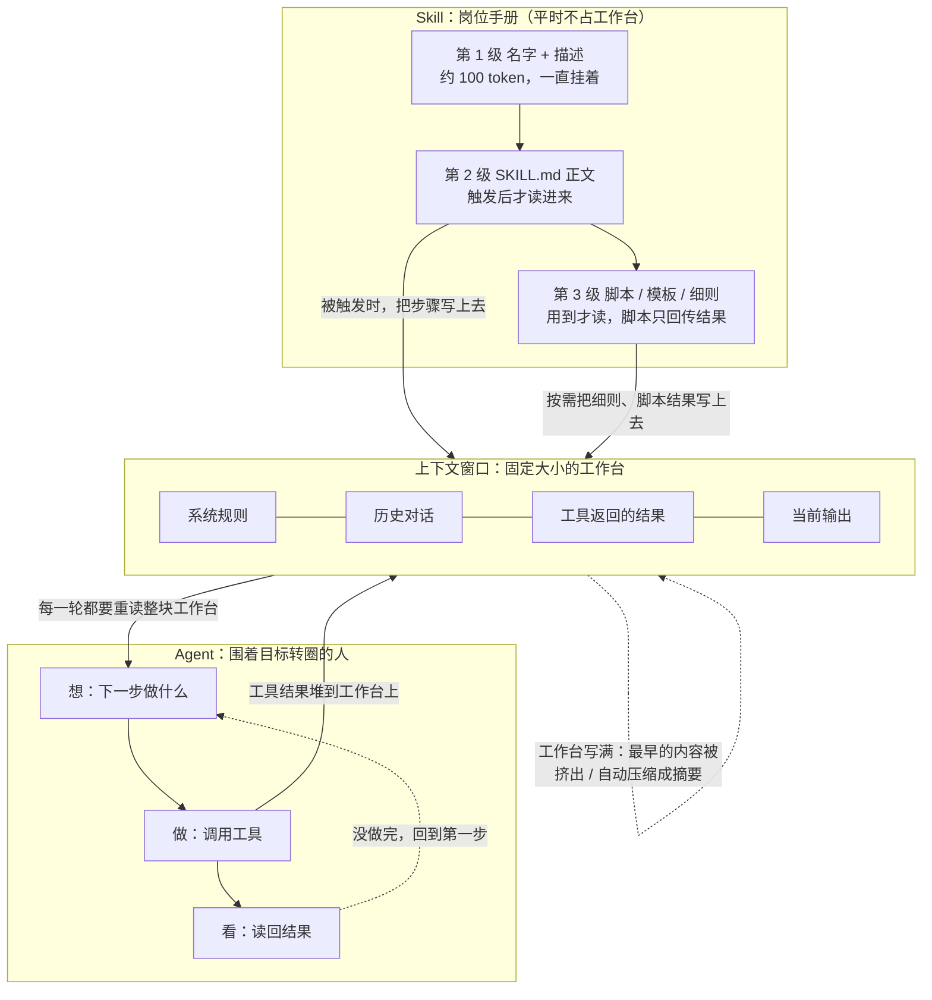
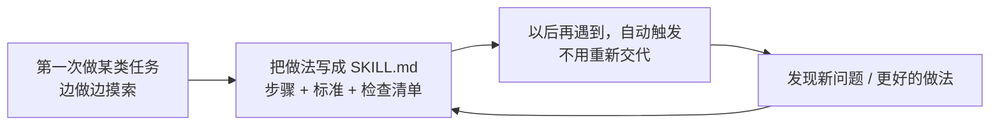

# 三个概念的关系：Agent、上下文、Skill

> 一句话总览：**Agent 是干活的人，上下文是他面前那块大小固定的工作台，Skill 是他手边那摞按需取用的岗位手册。**

配套的可视化版本见：[concept-relationship.html](concept-relationship.html)

---

## 一、三个概念各管一摊

| 概念 | 回答的问题 | 比喻 | 它不负责什么 |
| --- | --- | --- | --- |
| **Agent** | 谁来决定下一步、谁去动手 | 会自己规划的小助手 | 不负责记住长期知识，也不自带行业经验 |
| **上下文** | 此刻它能看见多少东西 | 面前那块固定大小的工作台 | 不是它的知识储备，对话一结束就清空 |
| **Skill** | 这件事该按什么步骤做 | 手边的岗位手册 / 菜谱 | 不会自己执行，要被 Agent 翻开才起作用 |

一句话串起来：**Agent 在上下文这块工作台上干活，干到不会的地方，就去翻 Skill 这本手册。**

---

## 二、关系图

---

## 三、重点一：上下文如何影响 Agent 的工作

这是三者关系里最容易出问题的地方。Agent 的每一步都依赖上下文，所以上下文的状态直接决定了 Agent 的表现。

### 3.1 上下文就是 Agent 的记事本

Agent 的循环是"想 → 做 → 看"。其中"看"到的东西，以及"想"出来的计划，全都写在上下文里。下一轮 Agent 判断"下一步做什么"时，唯一能参考的就是这块工作台上的内容。

**结论：上下文里有什么，Agent 就知道什么；上下文里没有的，它一无所知。**

### 3.2 工作台是累加的，所以 Agent 越干越贵

| 轮次 | 工作台上的内容 | 这一轮要读的量 |
| --- | --- | --- |
| 第 1 轮 | 目标 + 第 1 步结果 | 小 |
| 第 3 轮 | 目标 + 前 2 步全部结果 | 中 |
| 第 10 轮 | 目标 + 前 9 步全部结果 | 大 |

每一步的工具返回结果都留在工作台上，下一轮还要再读一遍。所以 **Agent 的步骤越多，后面的每一步就越慢、越贵**。

### 3.3 工作台写满，Agent 就开始"犯糊涂"

| 上下文的状态 | Agent 的表现 |
| --- | --- |
| 还很空 | 判断准确，能记住一开始定下的要求 |
| 用到七八成 | 开始偶尔重复做已经做过的动作 |
| 写满 | 最早的要求被挤出去，Agent 忘了最初的目标，或者卡在某一步反复转圈 |
| 内容又长又杂 | 即使没写满，准确率也会下降（context rot）；关键信息埋在中间最容易被漏掉 |

### 3.4 工程上的三种对策

| 对策 | 做法 | 对 Agent 的作用 |
| --- | --- | --- |
| **压缩** | 快满时，把前面的对话总结成一小段，带着摘要重新开始 | 保住目标不丢，让 Agent 继续跑下去 |
| **分块** | 长文档切成几段分别处理，最后合并 | 避免一次性把工作台塞爆 |
| **隔离** | 派一个"子代理"去干探索性的活，只把结论带回来 | 不让过程中的垃圾信息污染主工作台 |

---

## 四、重点二：Skill 如何沉淀可复用的任务知识

### 4.1 沉淀的是"怎么做"，不是"是什么"

Agent 缺的不是知识。大模型本来就懂很多东西，它缺的是**程序性知识**——也就是"你们公司这件事具体按什么流程办、先做什么后做什么、做完怎么检查"。Anthropic 在介绍 Agent Skills 时打的比方就是：给 Skill 写内容，就像给新入职的同事写一本入职指南。

Skill 沉淀下来的四样东西：

| 沉淀内容 | 举例 |
| --- | --- |
| **流程步骤** | 先查出处，再写解释，最后自检 |
| **判断标准** | 什么情况下该用这个做法，什么情况下不用 |
| **质量门槛** | 交付前必须逐条检查哪几项 |
| **现成资源** | 模板、脚本、参考资料 |

### 4.2 "三级加载"让沉淀几乎不占成本

这是 Skill 设计和上下文之间最精巧的一处配合：

| 级别 | 什么时候进工作台 | 占多少 |
| --- | --- | --- |
| 第 1 级：名字 + 描述 | 一直挂着 | 每个约 100 token |
| 第 2 级：SKILL.md 正文 | 被触发时 | 建议 5000 token 以内 |
| 第 3 级：脚本 / 模板 / 细则 | 用到时才读 | 几乎不占（脚本只回传运行结果） |

**这意味着：你可以沉淀海量的任务知识，而平时它们一点工作台都不占。** 知识存在文件夹里，用时才搬上工作台。

### 4.3 沉淀的闭环

一次写成，反复受益；每次使用中发现的问题，又可以回头改进 Skill 本身。

---

## 五、三者协同：一个完整的例子

任务：用本仓库的 Skill 生成一份"光合作用"的学习资料。

| 环节 | 谁在起作用 | 具体发生了什么 |
| --- | --- | --- |
| 1. 识别任务 | **Skill 第 1 级** | 模型扫到 `concept-learning-kit` 的描述与"学习一个概念"匹配 |
| 2. 装载做法 | **Skill 第 2 级 → 上下文** | SKILL.md 正文被读上工作台：先找类比、再查来源、按固定结构输出 |
| 3. 取用模板 | **Skill 第 3 级 → 上下文** | 需要写 HTML 时，才去读 `references/html-skeleton.md` |
| 4. 执行循环 | **Agent + 工具** | 检索来源 → 读文件 → 写 HTML → 打开检查，不对就改 |
| 5. 记录过程 | **上下文** | 每一步的想法和检索结果都堆在工作台上，供下一步参考 |
| 6. 收尾 | **上下文管理** | 任务很长时压缩历史，避免工作台写满导致后面质量下降 |

可以看到：**Skill 解决"会不会做"，上下文解决"记得住多少"，Agent 解决"能不能自己跑完"**。三者缺一个都不行。

---

## 六、一句话记住

- **没有上下文**，Agent 每一步都是第一次，会原地打转。
- **没有 Skill**，Agent 每次都要你从零教一遍，而且做法不统一。
- **没有 Agent**，Skill 只是一本没人翻的手册，上下文也只是一块没人用的黑板。

---

## 七、资料来源

1. Anthropic，《Building Effective Agents》
   https://www.anthropic.com/engineering/building-effective-agents
   支撑：Agent 循环依赖"增强型大模型"的检索、工具、记忆；简单方案优先。

2. Anthropic 官方开发者文档，《Context windows》
   https://platform.claude.com/docs/en/build-with-claude/context-windows
   支撑：上下文随轮次累加；token 增长导致 context rot；长对话需压缩管理。

3. Anthropic，《Equipping agents for the real world with Agent Skills》
   https://www.anthropic.com/engineering/equipping-agents-for-the-real-world-with-agent-skills
   支撑：Skill 沉淀程序性知识；三级渐进式披露；脚本只回传结果不进上下文。

4. Anthropic 官方开发者文档，《Agent Skills Overview》
   https://platform.claude.com/docs/en/agents-and-tools/agent-skills/overview
   支撑：三级加载各自的 token 开销；Skill 与一次性提示词的区别。
